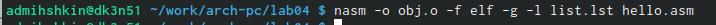

---
## Front matter
title: "Лабораторная работа 4"
subtitle: "НБИбд-02-22"
author: "Мышкин Антон Денисович"

## Generic otions
lang: ru-RU
toc-title: "Содержание"

## Bibliography
bibliography: bib/cite.bib
csl: pandoc/csl/gost-r-7-0-5-2008-numeric.csl

## Pdf output format
toc: true # Table of contents
toc-depth: 2
lof: true # List of figures
lot: true # List of tables
fontsize: 12pt
linestretch: 1.5
papersize: a4
documentclass: scrreprt
## I18n polyglossia
polyglossia-lang:
  name: russian
  options:
	- spelling=modern
	- babelshorthands=true
polyglossia-otherlangs:
  name: english
## I18n babel
babel-lang: russian
babel-otherlangs: english
## Fonts
mainfont: PT Serif
romanfont: PT Serif
sansfont: PT Sans
monofont: PT Mono
mainfontoptions: Ligatures=TeX
romanfontoptions: Ligatures=TeX
sansfontoptions: Ligatures=TeX,Scale=MatchLowercase
monofontoptions: Scale=MatchLowercase,Scale=0.9
## Biblatex
biblatex: true
biblio-style: "gost-numeric"
biblatexoptions:
  - parentracker=true
  - backend=biber
  - hyperref=auto
  - language=auto
  - autolang=other*
  - citestyle=gost-numeric
## Pandoc-crossref LaTeX customization
figureTitle: "Рис."
tableTitle: "Таблица"
listingTitle: "Листинг"
lofTitle: "Список иллюстраций"
lotTitle: "Список таблиц"
lolTitle: "Листинги"
## Misc options
indent: true
header-includes:
  - \usepackage{indentfirst}
  - \usepackage{float} # keep figures where there are in the text
  - \floatplacement{figure}{H} # keep figures where there are in the text
---

# Цель работы

Освоение процедуры компиляции и сборки программ, написанных на ассем-
блере NASM.

# Выполнение лабораторной работы

Создаем каталог для работы с программами на языке ассемблера NASM:

{ #fig:001 width=90% } (рис. [-@fig:001])

Перейдем в созданный каталог

{ #fig:002 width=90% } (рис. [-@fig:002])

Создадим текстовый файл с именем hello.asm

{ #fig:003 width=90% } (рис. [-@fig:003])

Откроем этот файл с помощью любого текстового редактора, например, gedit

{ #fig:004 width=90% } (рис. [-@fig:004])

Введем в него следующий текст

{ #fig:005 width=90% } (рис. [-@fig:005])

Для компиляции приведённого выше текста программы «Hello World» необходимо написать nasm -f elf hello.asm

{ #fig:006 width=90% } (рис. [-@fig:006])

С помощью команды ls проверяем, что объектный файл был создан. 

{ #fig:007 width=90% } (рис. [-@fig:007])

Выполняем следующую команду

{ #fig:008 width=90% } (рис. [-@fig:008])

С помощью команды ls проверяем, что файлы были созданы.

{ #fig:009 width=90% } (рис. [-@fig:009])

Объектный файл передаем на обработку компоновщику.

{ #fig:010 width=90% } (рис. [-@fig:010])

Выполняем следующую команду:

{ #fig:011 width=90% } (рис. [-@fig:011])

Запустим на выполнение созданный исполняемый файл, находящийся в
текущем каталоге, набрав в командной строке:

{ #fig:012 width=90% } (рис. [-@fig:012])

В каталоге ~/work/arch-pc/lab05 с помощью команды cp создаем копию
файла hello.asm с именем lab5.asm

{ #fig:013 width=90% } (рис. [-@fig:013])

С помощью любого текстового редактора внесем изменения в текст про-
граммы в файле lab5.asm так, чтобы вместо Hello world! на экран выво-
дилась строка с вашими фамилией и именем.

{ #fig:014 width=90% } (рис. [-@fig:014])

# Выводы

Я научился процедурам компиляции и сборки программ, написанных на ассем-
блере NASM.
