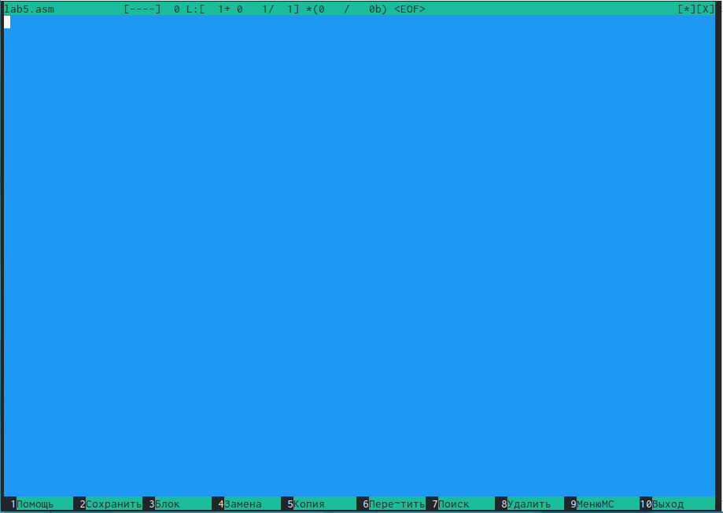

---
## Front matter
title: "Лабораторная работа No5. Основы работы с
Midnight Commander (mc). Структура
программы на языке ассемблера NASM.
Системные вызовы в ОС GNU Linux"
subtitle: "НБИбд-02-22"
author: "Мышкин Антон Денисович"

## Generic otions
lang: ru-RU
toc-title: "Содержание"

## Bibliography
bibliography: bib/cite.bib
csl: pandoc/csl/gost-r-7-0-5-2008-numeric.csl

## Pdf output format
toc: true # Table of contents
toc-depth: 2
lof: true # List of figures
lot: true # List of tables
fontsize: 12pt
linestretch: 1.5
papersize: a4
documentclass: scrreprt
## I18n polyglossia
polyglossia-lang:
  name: russian
  options:
	- spelling=modern
	- babelshorthands=true
polyglossia-otherlangs:
  name: english
## I18n babel
babel-lang: russian
babel-otherlangs: english
## Fonts
mainfont: PT Serif
romanfont: PT Serif
sansfont: PT Sans
monofont: PT Mono
mainfontoptions: Ligatures=TeX
romanfontoptions: Ligatures=TeX
sansfontoptions: Ligatures=TeX,Scale=MatchLowercase
monofontoptions: Scale=MatchLowercase,Scale=0.9
## Biblatexcd ~/work/study/2022-2023/"Архитектура
компьютера"/arch-pc/labs/lab04/report
biblatex: true
biblio-style: "gost-numeric"
biblatexoptions:
  - parentracker=true
  - backend=biber
  - hyperref=auto
  - language=auto
  - autolang=other*
  - citestyle=gost-numeric
## Pandoc-crossref LaTeX customization
figureTitle: "Рис."
tableTitle: "Таблица"
listingTitle: "Листинг"
lofTitle: "Список иллюстраций"
lotTitle: "Список таблиц"
lolTitle: "Листинги"
## Misc options
indent: true
header-includes:
  - \usepackage{indentfirst}
  - \usepackage{float} # keep figures where there are in the text
  - \floatplacement{figure}{H} # keep figures where there are in the text
---

# Цель работы

Приобретение практических навыков работы в Midnight Commander. Освоение
инструкций языка ассемблера mov и int.

# Задание

Здесь приводится описание задания в соответствии с рекомендациями
методического пособия и выданным вариантом.

# Выполнение лабораторной работы

Пользуясь клавишами ↑ , ↓ и Enter перейдем в каталог ~/work/arch-
pc созданный при выполнении лабораторной работы No4 

{ #fig:001 width=110% } (рис. [-@fig:001])

С помощью функциональной клавиши F7 создаем папку lab05 
и перейдем в созданный каталог.

{ #fig:001 width=110% } (рис. [-@fig:001])

{ #fig:001 width=110% } (рис. [-@fig:001])

Пользуясь строкой ввода и командой touch создадим файл lab5-1.asm 

{ #fig:001 width=110% } (рис. [-@fig:001])

С помощью функциональной клавиши F4 откроем файл lab5-1.asm для редактирования во встроенном редакторе.

{ #fig:001 width=110% } (рис. [-@fig:001])

.png){ #fig:001 width=110% } (рис. [-@fig:001])

Оттранслируем текст программы lab5-1.asm в объектный файл. Выполним компоновку объектного файла и запустим получившийся исполняемый
файл. Программа выводит строку 'Введите строку:' и ожидает ввода с
клавиатуры. На запрос вводим ФИО.

{ #fig:001 width=110% } (рис. [-@fig:001])

Исправим текст программы в файле lab5-2.asm с использование под-
программ из внешнего файла in_out.asm (используйте подпрограммы
sprintLF, sread и quit) в соответствии с листингом 6.2. Создадим испол-
няемый файл и проверим его работу

{ #fig:001 width=110% } (рис. [-@fig:001])

Скачаем файл in_out.asm со страницы курса в ТУИС.
В одной из панелей mc откроем каталог с файлом lab5-1.asm. В другой панели
каталог со скаченным файлом in_out.asm (для перемещения между панелями
используйте Tab ). Скопируйте файл in_out.asm в каталог с файлом lab5-1.asm
с помощью функциональной клавиши F5

{ #fig:001 width=110% } (рис. [-@fig:001])

С помощью функциональной клавиши F6 создадим копию файла lab6-
1.asm с именем lab5-2.asm. Выделите файл lab5-1.asm, нажмите клавишу
F6 , введите имя файла lab5-2.asm и нажмите клавишу Enter 

{ #fig:001 width=110% } (рис. [-@fig:001])

# Выводы

Приобрел практических навыков работы в Midnight Commander. Освоение
инструкций языка ассемблера mov и int.

