---
## Front matter
title: "Лабораторная работа No6. Арифметические
операции в NASM."
subtitle: "НБИбд-02-22"
author: "Мышкин Антон Денисович"

## Generic otions
lang: ru-RU
toc-title: "Содержание"

## Bibliography
bibliography: bib/cite.bib
csl: pandoc/csl/gost-r-7-0-5-2008-numeric.csl

## Pdf output format
toc: true # Table of contents
toc-depth: 2
lof: true # List of figures
lot: true # List of tables
fontsize: 12pt
linestretch: 1.5
papersize: a4
documentclass: scrreprt
## I18n polyglossia
polyglossia-lang:
  name: russian
  options:
	- spelling=modern
	- babelshorthands=true
polyglossia-otherlangs:
  name: english
## I18n babel
babel-lang: russian
babel-otherlangs: english
## Fonts
mainfont: PT Serif
romanfont: PT Serif
sansfont: PT Sans
monofont: PT Mono
mainfontoptions: Ligatures=TeX
romanfontoptions: Ligatures=TeX
sansfontoptions: Ligatures=TeX,Scale=MatchLowercase
monofontoptions: Scale=MatchLowercase,Scale=0.9
## Biblatex
biblatex: true
biblio-style: "gost-numeric"
biblatexoptions:
  - parentracker=true
  - backend=biber
  - hyperref=auto
  - language=auto
  - autolang=other*
  - citestyle=gost-numeric
## Pandoc-crossref LaTeX customization
figureTitle: "Рис."
tableTitle: "Таблица"
listingTitle: "Листинг"
lofTitle: "Список иллюстраций"
lotTitle: "Список таблиц"
lolTitle: "Листинги"
## Misc options
indent: true
header-includes:
  - \usepackage{indentfirst}
  - \usepackage{float} # keep figures where there are in the text
  - \floatplacement{figure}{H} # keep figures where there are in the text
---

# Цель работы

Освоение арифметических инструкций языка ассемблера NASM

# Выполнение лабораторной работы

Создаем каталог для программам лабораторной работы No 7, переходим в
него и создайте файл lab7-1.asm:

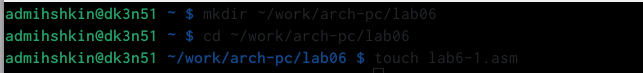{ #fig:001 width=90% }(рис. [-@fig:001])

Рассмотрим примеры программ вывода символьных и численных значе-
ний. Программы будут выводить значения записанные в регистр eax.
Создаем исполняемый файл и запускаем его.

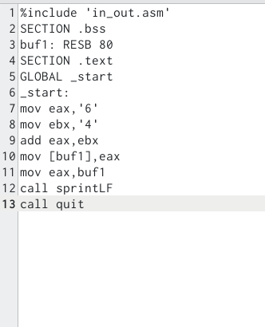{ #fig:002 width=90% }(рис. [-@fig:002])

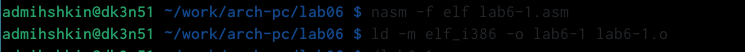{ #fig:002 width=90% }(рис. [-@fig:002])

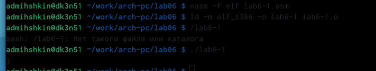{ #fig:002 width=90% }(рис. [-@fig:002])

Далее изменим текст программы и вместо символов, запишем в реги-
стры числа. Исправьте текст программы (Листинг 1) следующим образом:
заменим строки
mov eax,'6'
mov ebx,'4'
на строки
mov eax,6
mov ebx,4

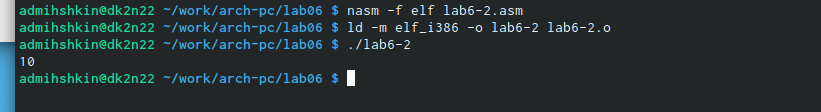{ #fig:003 width=90% }(рис. [-@fig:003])

Как отмечалось выше, для работы с числами в файле in_out.asm реализова-
ны подпрограммы для преобразования ASCII символов в числа и обратно.
Преобразуем текст программы из Листинга 7.1 с использованием этих
функций.
Создаем файл lab7-2.asm в каталоге ~/work/arch-pc/lab07 и введем в него
текст программы из листинга 7.2.

{ #fig:003 width=90% }(рис. [-@fig:004])

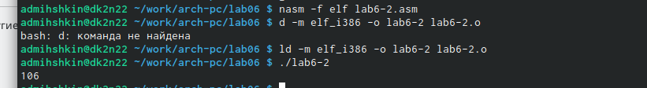{ #fig:003 width=90% }(рис. [-@fig:004])

В качестве примера выполнения арифметических операций в NASM при-
ведем программу вычисления арифметического выражения 𝑓(𝑥) = (5 ∗ 2 +
3)/3.

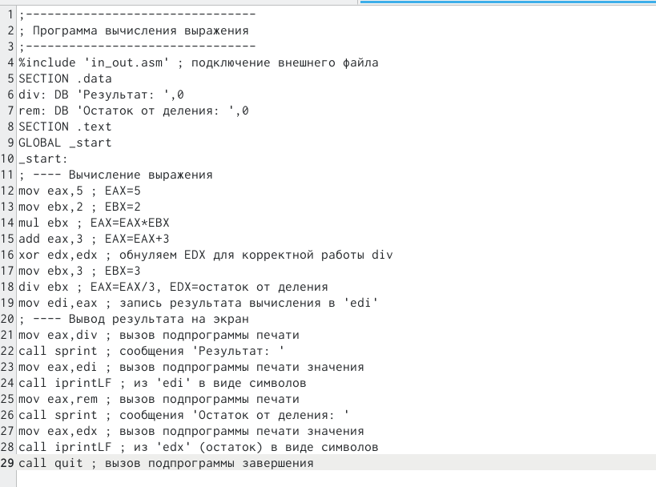{ #fig:006 width=90% }(рис. [-@fig:006])

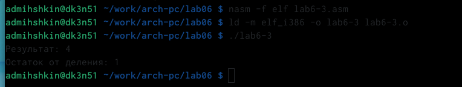{ #fig:006 width=90% }(рис. [-@fig:006])

Изменим текст программы для вычисления выражения 𝑓(𝑥) = (4 ∗ 6 + 2)/5.
Создаем исполняемый файл и проверяем его работу.

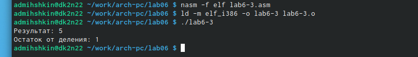{ #fig:006 width=90% }(рис. [-@fig:006])

 В качестве другого примера рассмотрим программу вычисления варианта
 задания по номеру студенческого билета, работающую по следующему
алгоритму:
• вывести запрос на введение No студенческого билета
• вычислить номер варианта по формуле: (𝑆𝑛 mod 20) + 1, где 𝑆𝑛 –
номер студенческого билета (В данном случае 𝑎 mod 𝑏 – это остаток
от деления 𝑎 на 𝑏).
• вывести на экран номер варианта

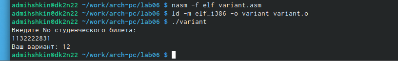{ #fig:007 width=90% }(рис. [-@fig:007])

# Выполнение самостоятельной работы

 Написать программу вычисления выражения 𝑦 = 𝑓(𝑥). Программа должна
выводить выражение для вычисления, выводить запрос на ввод значения
𝑥, вычислять заданное выражение в зависимости от введенного 𝑥, выво-
дить результат вычислений. Вид функции 𝑓(𝑥) выбрать из таблицы 6.3
вариантов заданий в соответствии с номером полученным при выполне-
нии лабораторной работы. Создайте исполняемый файл и проверьте его
работу для значений 𝑥1 и 𝑥2 из 6.3.
x=1

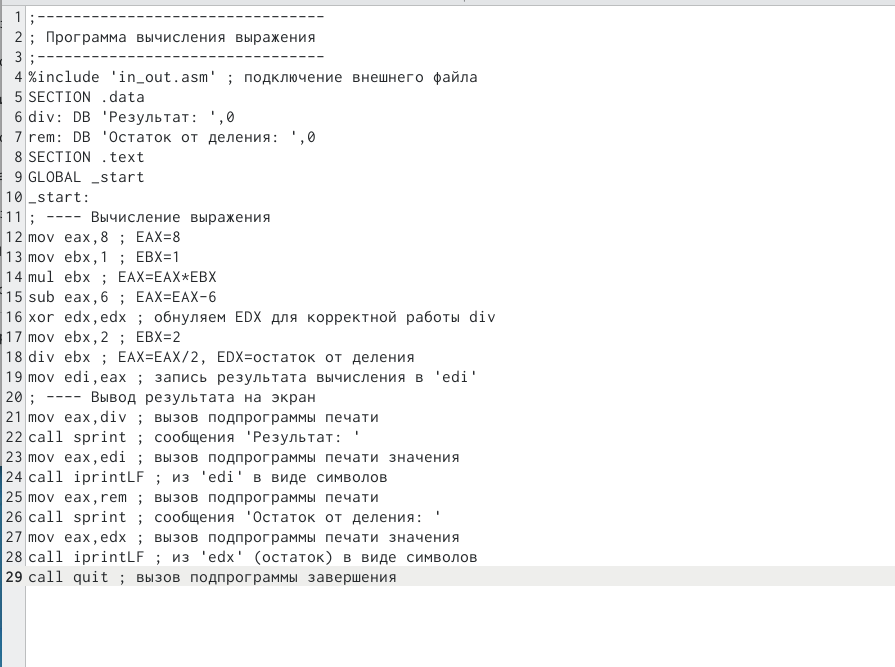{ #fig:008 width=90% }(рис. [-@fig:008])

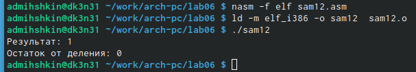{ #fig:008 width=90% }(рис. [-@fig:008])

x=5

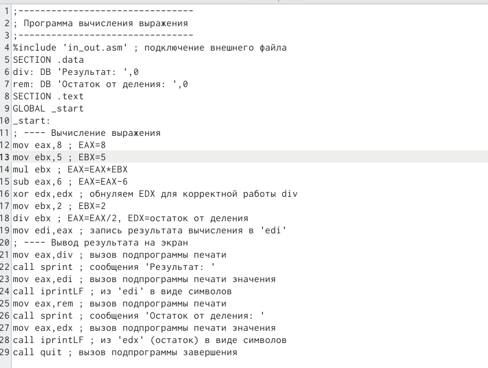{ #fig:008 width=90% }(рис. [-@fig:008])

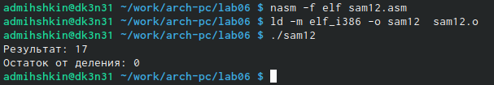{ #fig:008 width=90% }(рис. [-@fig:008])

# Выводы

Я освоил арифметические инструкции языка ассемблера NASM

